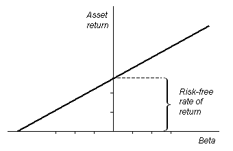

#量化投资 --- 技术篇 (1) 
## CAPM（Capital Asset Pricing Model）

## 一. 简介

​	CAPM理论即资本资产定价模型是由Sharpe、Lintner等多人在Markowitz的现代投资理论(Modern Portforlio Theory)上建立的，并在1990年获得了Nobel经济学奖。值得一提的是Fischer Black提出了一个重要的CAPM的变种称为Black CAPM，并在实践中表现出了更强的鲁棒性。

​	CAPM的核心思想如下：

​	-  任何股票的收益可以分为系统性(市场)收益和残留收益。
​	-  残留收益的期望收益为0。
​	-  CAPM和有效市场理论是密切相关的。
​	-  CAPM主要对收益率建模。

## 二. 定义

​	符号定义：

​		$$R_i$$ 	某资产$$i$$的收益

​		$$R_f$$ 	无风险收益

​		$$R_m$$	市场收益

​		$$\beta_p = \frac{Cov(R_p,R_m)}{Var(R_m)}$$代表资产$$p$$与市场收益的回归系数

​		$$\alpha_i$$ 代表某资产或投资组合$$i$$的alpha收益，也就是回归结果的截距项

​		$$\epsilon_i \sim N(0,\sigma^2)$$是高斯误差项

 1.    第一种形式

       $$E(R_i) - R_f = \beta_i(E(R_m)-R_f)$$ 			(2.1)

       ​	等式左边是资产期望收益与无风险收益的差，即超额期望收益(Excess Return)；等式右边是市场收益的期望超额收益乘以回归系数，这里的回归系数$$\beta_i$$可以理解为对市场期望超额收益的敏感度。

       ​	CAPM理论认为超额收益是与市场的超额收益相关的，其关系用敏感度来表示。假如$$\beta=1$$，则说明该资产的投资收益与市场收益是一样的；如果$$\beta=2$$，那么说明其超额收益是市场超额收益的两倍，若市场超额收益为负，该资产的亏损也是市场亏损的两倍。

       ​	

2. 第二种形式

  $$r_{it} = \alpha_i + \beta_ir_{mt}+\epsilon_{it}$$					(2.2)

  ​	把某个资产或投资组合的收益用市场收益进行一元线性回归，得到截距项$$\alpha_i$$，系数项$$\beta_i$$和一个高斯误差$$\epsilon_{it}$$。请注意(2.2)式指的是资产或组合在一段时间内的收益，是可观测到的，而(2.1)式指的是期望收益，是不可观测到的。实践中我们可以采用最大似然估计(MLE)来估算$$\alpha$$和$$\beta$$.

  ​	这里：

  ​	$$E(\epsilon_{it}) = 0$$, 市场超额收益$$r_{mt}$$与误差项$$\epsilon_{it}$$是独立不相关的，$$\epsilon_{it}$$在不同时间段也是不相关的。

  ​	$$r_{it}$$代表某资产在某段时间$$t$$内的超额收益，$$r_{mt}$$代表某资产在某段时间的市场超额收益。

  ​	截距项$$\alpha_i$$称为alpha收益，是该资产的特定收益；而系数项$$\beta_ir_{mt}$$是该资产的市场相关收益，也称为beta收益。对(2.2)式取期望，在(2.1)成立的情况下，得到$$E(\alpha)=0$$ 就是说所有资产的alpha收益的期望应该为0.

## 三. 详解

​	看完了前面枯燥的公式和定义，我们需要从直观上理解CAPM理论在告诉我们什么。

我们可以从另外一个角度解读公式(2.1)，某资产或组合的风险中包含市场风险(系统性风险)，该风险是不可分散的。实际上，公式(2.1)成立有如下假设：

- 所有的投资者都是参照 （期望收益 - 收益标准差）的原则进行投资的

- 可以以无风险利率$$R_f$$借入或借出任何量的资金

- 投资者对资产的收益的概率分布的认知是完全一样的。

  在这三个条件下，市场收益是均值方差有效的，换句话说如果(2.1)式满足，市场必定是有效的。

  但是，如果你想验证CAPM理论，例如统计检验方法（卡方检验或者log ratio test等)，你会发现你得到的结论和CAPM理论式不相符的。主要是因为CAPM的假设在实际的金融市场是不可能完全成立的，而且你很难确定真实的市场收益是什么。下面我们来进一步说明CAPM试图告诉我们的两个关键点：  

### 1. SML (Security Market Line)

​	

​	图中，横坐标是beta，纵坐标是资产收益。SML告诉我们，资产的超额收益与市场超额收益的比应该就是该资产的系统风险，即$$\beta$$ .

### 2. 资产定价

​	当我们通过CAPM理论计算出来资产的期望收益时，我们就可以比较资产在一段时间的收益和CAPM计算结果，从而评价该资产是否是一个合适的投资，也可以那CAPM结果和通过基本面分析和技术分析估算的结果进行比较。通过比较，我们可以推测一个资产是被低估了还是高估了。CAPM的定价公式为：

​	$$P_0=\frac{1}{1+R_f}[E(P_T)-\frac{Cov(P_T,P_M)(E(R_M)-R_f)}{Var(R_M)}]$$    			（2.3）

​	公式中，$$P_0$$代表在时刻0的价格，$$P_T$$代表时刻T的价格。(2.3)式是说某资产在0时刻的价格就是其在T时刻的估算价格减去其CAPM估算收益后以无风险利率折现的价格。	

## 四. 补充

​	最后我们简要介绍一下CAPM的一个重要变种，Black CAMP，也称为zero-beta CAPM。

​	Black CAPM并不假设能够随意以无风险利率借入和借出资金，这一点也是符合客观实施的。同时它增加了无做空的约束条件。

​	BLACK CAPM引入了一个相对于市场的beta值为0的资产，我们称之为$$Z$$ . 以此资产的收益代替原CAPM公式中的无风险收益，得到：

​	$$E(R_p)=E(R_Z)+\beta_p(E(R_M)-E(R_Z))$$					（2.4）

​	BLACK CAPM在实践中表现了比原CAPM更好的性能和更强的鲁棒性。

